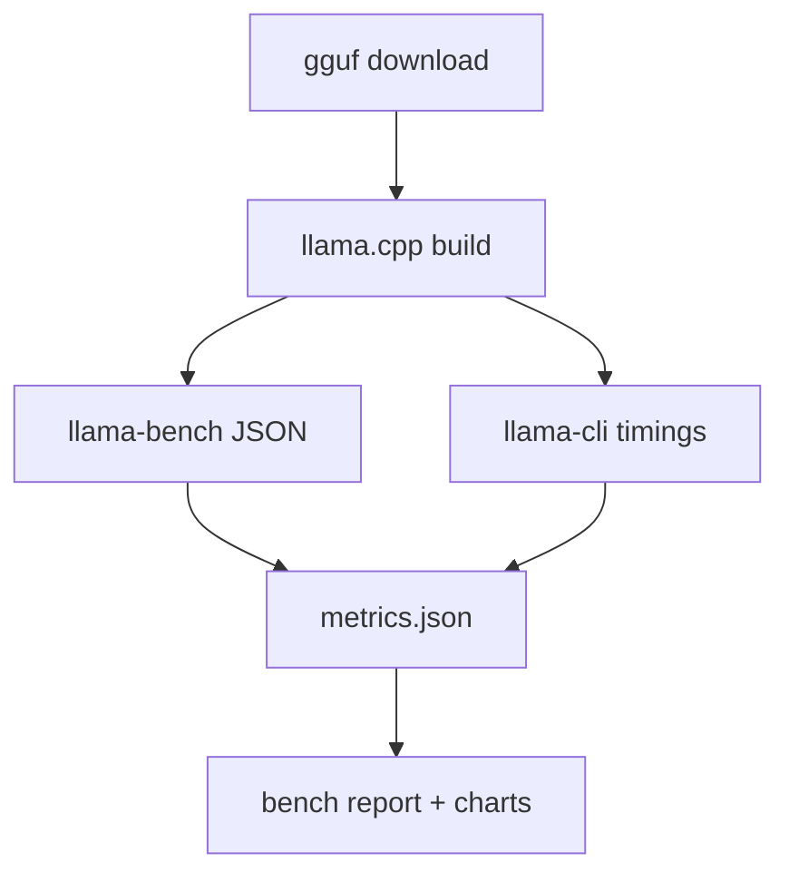

# OnDevice LLM Toolkit

OnDevice LLM Toolkit (ODLT) is a macOS-first CLI for benchmarking `llama.cpp` and managing GGUF models locally.

## Quickstart

```bash
python -m venv .venv
source .venv/bin/activate
pip install -e .[dev]

# Build native helper (optional but recommended)
./scripts/build_native.sh

# Download the default model
odlt gguf download

# Build llama.cpp
odlt deps build-llama

# Run a benchmark
odlt bench run

# Generate a report
odlt bench report
```

## CLI Examples

```bash
# Download a specific GGUF file
odlt gguf download --model-id Qwen/Qwen2.5-1.5B-Instruct-GGUF \
  --file qwen2.5-1.5b-instruct-q4_k_m.gguf

# Verify a local GGUF
odlt gguf verify --file-path ~/.ondevice-llm-toolkit/models/qwen2.5-1.5b-instruct-q4_k_m.gguf

# Create a manifest
odlt gguf manifest --file-path ~/.ondevice-llm-toolkit/models/qwen2.5-1.5b-instruct-q4_k_m.gguf \
  --output manifest.json

# Smoke test a model
odlt gguf smoke --model-path ~/.ondevice-llm-toolkit/models/qwen2.5-1.5b-instruct-q4_k_m.gguf

# Run a tuned benchmark
odlt bench run --n-prompt 1024 --n-gen 256 --repetitions 3 --threads 8 --n-gpu-layers 99

# Report over all runs
odlt bench report --runs-dir ~/.ondevice-llm-toolkit/runs
```

## Bench Pipeline



## Configuration

Config is stored in `~/.ondevice-llm-toolkit/config.yaml`. Defaults include:

- Default model: `Qwen/Qwen2.5-1.5B-Instruct-GGUF`
- Default file: `qwen2.5-1.5b-instruct-q4_k_m.gguf`
- llama.cpp pinned commit for reproducibility
- Set `ODLT_HOME` to override the base directory

## Reproducibility

- `llama.cpp` is pinned to a commit for deterministic builds.
- Hugging Face downloads can be pinned via the `revision` field in config.

## Public-safe Guidance

- Do not commit GGUF weights or private datasets to the repo.
- Keep tokens and credentials in environment variables or local config.

## Release Steps

1. Run `odlt gguf download` and `odlt bench run` on a fresh macOS machine.
2. Tag `v0.1.0` and push to the public GitHub repo.

## References

- llama.cpp build guide: https://github.com/ggml-org/llama.cpp/blob/master/docs/build.md
- llama.cpp CLI tools: https://github.com/ggml-org/llama.cpp/blob/master/README.md
- Hugging Face Hub download API: https://huggingface.co/docs/huggingface_hub/en/package_reference/file_download
